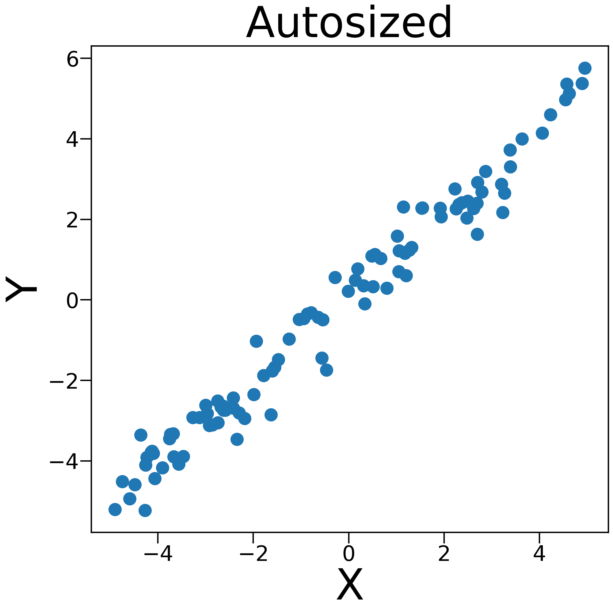
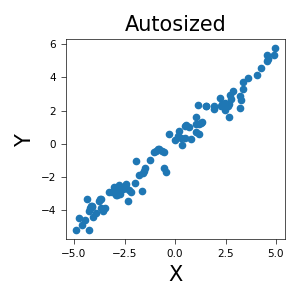
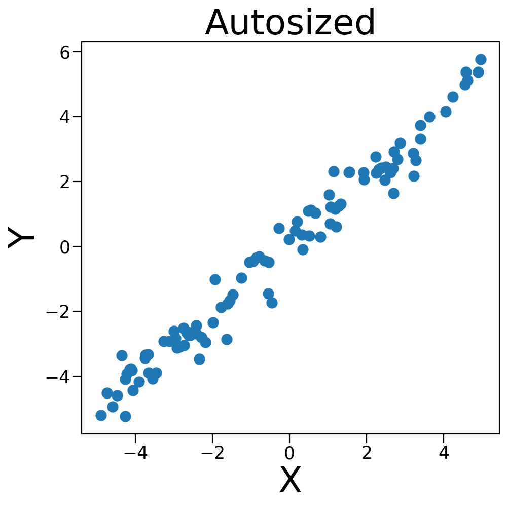

# plottify

The plottify package is makes matplotlib plots more legible. It's a thin wrapper around [matplotlib](https://matplotlib.org/) that automatically adjusts font sizes, scatter point sizes, line widths, etc. according to the figure size.

## Installation

```
pip install plottify
```

## Usage

The plottify interface is extremely simple and relies on one central function, `autosize()`. After you've created a plot, simply call `autosize()` and the sizes will be adjusted:

```python
from plottify import autosize
import matplotlib.pyplot as plt

plt.scatter(x, y)
autosize()
plt.show()
```

If you have a matplotlib figure object, you can pass it as an argument to `autosize`:

```python
autosize(fig)
```

## Demonstration

By default, matplotlib sets the sizes of these objects to pre-specified values, regardless of the figure size. This can result in tiny fonts or sizes for larger figures:


Plottify's `autosize` function adjusts these sizes automatically to make them more legible:



When we change the figure size, plottify automatically adjusts the objects' sizes:






## Bugs and feature requests

Please report any bugs or feature requests as a GitHub issue.
