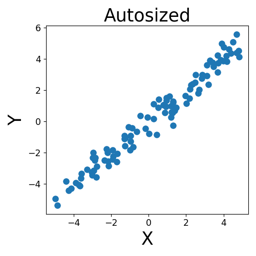

# plottify

The plottify package is intended to easily make plots more legible. It's a thin wrapper around [matplotlib](https://matplotlib.org/) that automatically adjusts font sizes, scatter point sizes, line widths, etc. according to the figure size.

By default, matplotlib sets the sizes of these objects to pre-specified values, regardless of the figure size. This can result in tiny fonts or sizes for larger figures:

Plottify's `autosize` function adjusts these sizes automatically to make them more legible:

